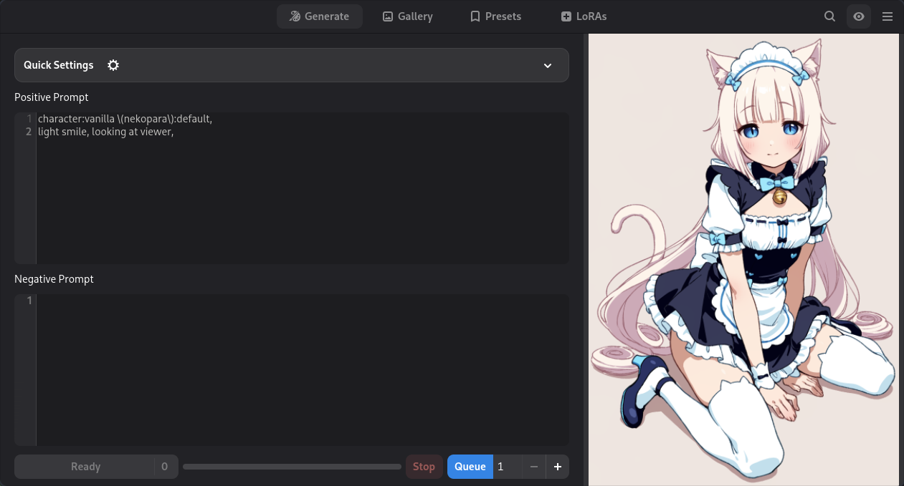

<h1 align="center">
  
  <span>CozyApp</span>
</h1>
</br>

A cozy GTK frontend for ComfyUI using LibAdwaita and custom nodes, designed to simplify image generation.




### Dependencies
> [!NOTE]
> My node pack is currently required for this program to function. I'd like to include a more simplified workflow without a detailer that uses all built-in nodes, but it currently depends on my nodes for detailing.

- [Impact pack](https://github.com/ltdrdata/ComfyUI-Impact-Pack)
- [Impact subpack](https://github.com/ltdrdata/ComfyUI-Impact-Subpack)
- [Mudknight utils](https://github.com/mudknight/comfyui-mudknight-utils)
- [LoRA Manager](https://github.com/willmiao/ComfyUI-Lora-Manager)

### Development
Set up a venv:
```
python -m venv .venv
```

Install requirements
```
.venv/bin/pip install -r requirements.txt
```

Run
```
.venv/bin/python main.py
```

### Usage
Run the latest release.
